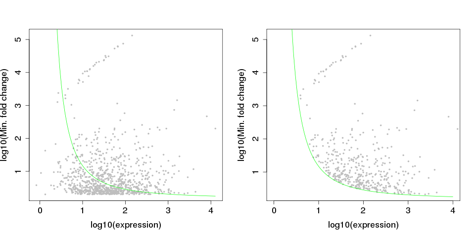
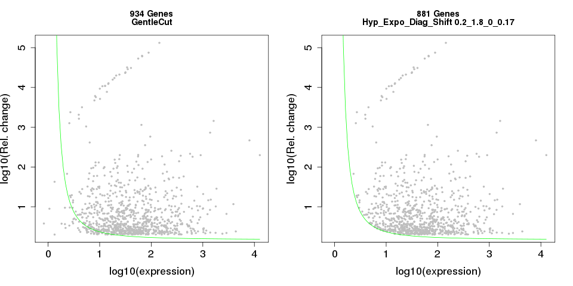
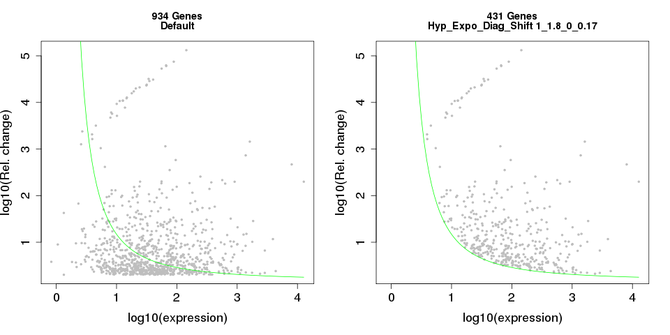
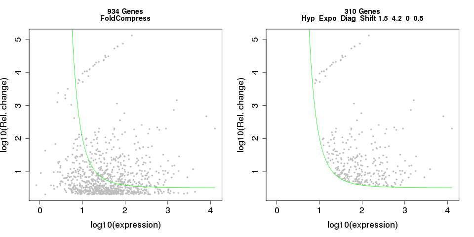
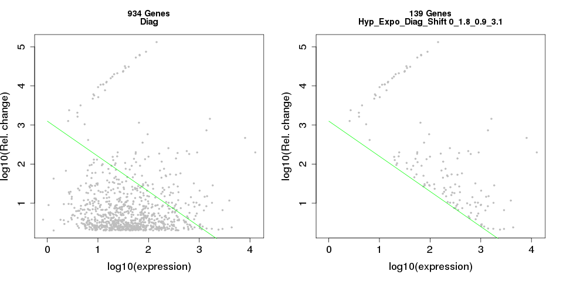
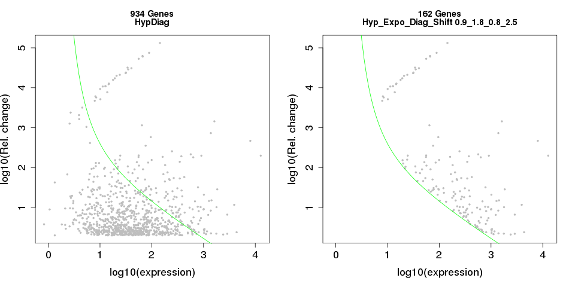

# HypExpo: Hyperbolic-exponential filter for marker gene selection




**Quick Introduction**. In the above example of a real-world data, 934 input genes were pre-selected by application of a combination of statistical test for differential expression (FDR < 0.05) and a uniform fold change of 2 (left panel). After application of the HypExpo adaptive filter (right panel), 431 genes with more relevant combinations of fold change and the expression level in the target cell type were selected as markers. 


----
## Citing HypExpo
If you use the HypExpo, please cite:

- Kumar A., D’Souza S.S., Moskvin O.V., Toh H., Wang B., Zhang J., Swanson S., Guo L., Thomson J., and Slukvin I.I. (2017) Specification and Diversification of Pericytes and Smooth Muscle Cells from Mesenchymoangioblasts. Cell Rep. 19(9):1902-1916.


## Background

### The problem

In biological research that relies on transcriptomic data, statistical significance of differential gene expression is 
not equivalent to their usefulness for downstream follow-up. A conventional solution is to apply a combination of statistical significance (FDR) and a form of "biological significance" (fold change) to select for the promising genes. At this time, we leave aside the issue of subtle genome-wide shifts that are very useful for functional enrichment analysis and focus of marker gene selection, where the problem of calling a particular gene significant or not is explicit. The problem with the above "FDR+fold chanage" approach is instantly visible when you look at the real-world data: you may be interested in a highly expressed gene which was upregulated, say, 2 times, but not necessarily in a low-expressed gene that shows the same relative upregulation. While statistical algorithms take very seriousely the issue of accounting for dependence of variance on expression level, to derive the most reliable differential expression (DE) calls, there is the second layer to this problem: even given an Ideal World situation that you have Absolutely Relaible DE calls across the entire spectrum of the expression values, you will weight gene expression-fold changes combinations differently, for the purpose of their follow-up value, from biological standpoint. De facto, despite all the statistical sophistication in play, the biologist-driven gene selection for the follow-up in the case of marker genes is still largely manual.   


### The expectation

One may be interested in picking (out of the list of genes passed FDR + conventioal fold change filter) of high expressors with less strict relative change requirement, as well as low expressors, if their relative change in expression is especially dramatic. This calls for an adaptive filtering that tune the relative change threshold depending on the expression value. 


### The solution

We present HypExpo, a simple adaptive filtering framework with 5 parameters that allow to construct filters of various shapes. The useabilty of particular shapes and parameter optimization issues may be explored by variety of approaches, including assessment of the resulting gene lists in context of functional categories, network patterns etc., and is open to the community for discussion. 


## Using HypExpo 


### Input

Besides the options (below), the script takes the data frame of 2 columns. 

The first column should contain linear expression values in the upregulated condition (the target condition for biomarker search)

The second column should contain a sort of Relative Change value (either Fold Change, or - better - the Critical Coefficient, below). 

The object may contain other columns which would be ignored. The result will be appended as the last column. 

Row names should represent gene names. Column names are of no importance. 

An example file (which may be used to reproduce the graphs shown on this page) is supplied as ``` thedata.rda ```

**Warning! Please supply the data for statistically significant genes only, downstream of your favorite statistical testing! HypExpo is a downstream filter and NOT a substitute for statistical testing!** 

The program operates in dual log-transformed space: both expression levels and fold changes are subject to preliminary log transformation within the script, internally. Please provide linear values as an input. 

The script accepts positive values in both of the 2 columns since it was designed to be used a) in context of expression markers and b) with the "critical coefficients" [(Moskvin et. al., 2014)](http://www.tandfonline.com/doi/full/10.1080/21628130.2015.1010923) instead of fold changes; the latter are always positive. 

*Still, other types of data may be easily adapted. If you want to apply the system to downregulation phenomena and have in your data object either negative fold changes or fractional values 0 to 1, please transform the data accordingly before supplying it to the script (in the case of negative values, subset the downregulated data by selecting for negative fold and then switch the fold sign; in the case of fractional fold values, subset the data by selecting for 0 < fold < 1 and invert the fold values; use the absolute expression in the reference - not target! - condition for downregulation study); the transformed subsets may be used to find the most interesting downregulated genes. This issue will be specifically addressed in an extended HypExpo version.* 


### Output

When ``` preview.only ``` option is set to FALSE, the script outputs the following:

1) PNG file with 2 panels showing genes before and after filtering and the filtering curve on both of them, plus the numbers of genes before and after filtering and filtering paramters in the image header;

2) an R object of type "list" where: 

- the first list item is the modified input dataframe (a binary column with either "0" or "1" is added to indicate genes failed or passed the filter, respectively);
- the second list item is the dataframe restricted to the genes that passed the filter;
- the third list item is the vector of gene names that pass the filtering. 

When ``` preview.only ``` option is set to TRUE, only a preview graph within the R session is generated, showing the curve shape, gene cloud and the number of selected genes.  


### Options 

``` thedata ``` is the dataframe object having the format described above

``` param.hyp ``` the numerator of the inverse function

``` param.expo ``` is the power of "x" in the denominator of the inverse function

``` param.diag ``` is the slope of the linear component of the function 

``` param.shift ``` is a constant which is equivalent to y-intercept when the ``` param.hyp ``` is equal to zero. Setting all parameters other than this one to zero would result in a simple fold change filter.

``` param.xshift ``` is a constant subtracted from the log-transformed expression values

``` baseName ``` is a no-space descriptive ID of the current selection procedure

``` preview.only ``` switches the program execution from the default exploratory mode (``` preview.only=TRUE ```) when neither output object nor graphical file are generated, and the only output is the graph in the R graphical window, to the execution mode (``` preview.only=FALSE ```) which results in generating a graph file in PNG format and the output object.  

One may rapidly and visually explore the results of parameter combinations using the default preview mode, before switching to generation of the actual output. 

At first, it is recommended to keep one of the 2 parameters - ``` param.hyp ``` or ``` param.diag ``` - equal to zero, to avoid overcomplicating of the filter shape. Those two parameters, while being non-zero, represent two complementary strategies of filtering (hyperbolic filter and a "diagonal cut"). However, interesting and relevant combinations of the two are possible (see example #5 below). 


### Flexible construction of the selection modes 

HypExpo may be used to construct a variety of purpose-focused filters with different behaviour. Here we present a few illustrations of the impact of the tuning parameters on the resulting filter shape. 


**1. Gentle cut of the lowest-expressed genes only by setting ``` param.hyp ``` to very low value:**

``` result <- HypExpo(thedata, param.hyp=0.2, baseName="GentleCut", preview.only=FALSE) ``` 



**2. The intermediate selection with default parameters** This reproduces the "quick introduction" figure you have already seen: 

``` result <- HypExpo(thedata, baseName="Default", preview.only=FALSE) ``` 



**3. Setting ``` param.expo ``` to unusually high value would result in flattening the fold change cutoff for genes with wide range of higher expression values, while strictly penalizing low expressors:**

``` result <-  HypExpo(thedata, param.hyp=1.5, param.expo=4.2, param.diag=0, param.shift=0.5, baseName="FoldCompress", preview.only=FALSE) ``` 



**4. Diagonal cut by setting ``` param.hyp ``` to zero and engaging ``` param.diag ``` and ``` param.shift ```**

```  result <-  HypExpo(thedata, param.hyp=0, param.diag=0.9, param.shift=3.1, baseName="Diag", preview.only=FALSE) ``` 



**5. Diagonal cut over higher expressed genes with stricter penalizing of low-expressors with hyperbolic component:**

``` result <-  HypExpo(thedata, param.hyp=0.9, param.diag=0.8, param.shift=2.5, baseName="HypDiag", preview.only=FALSE) ``` 



